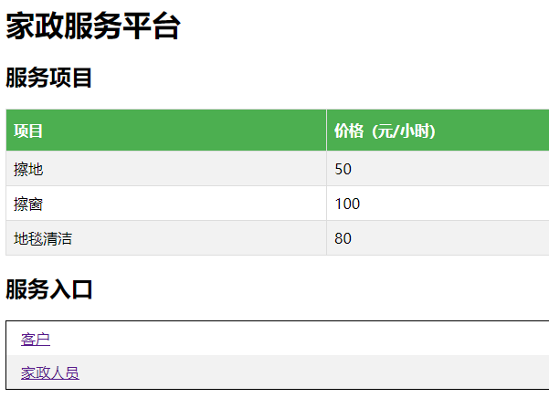
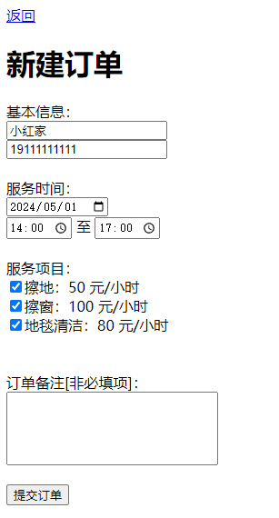
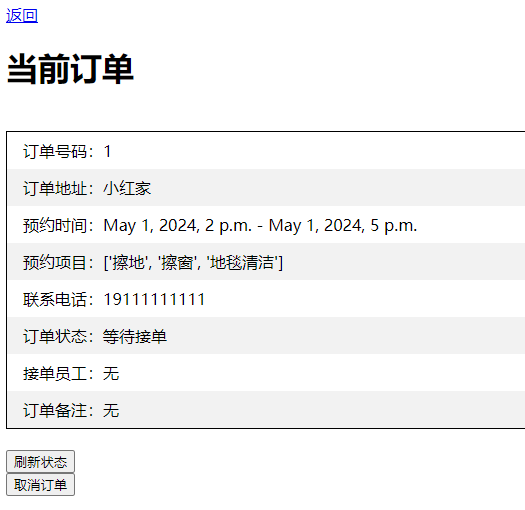
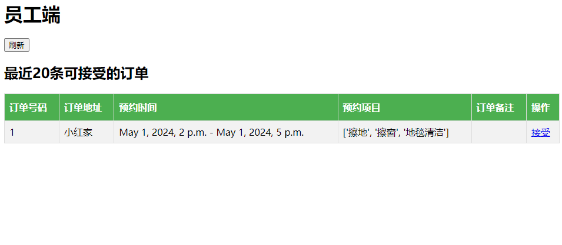
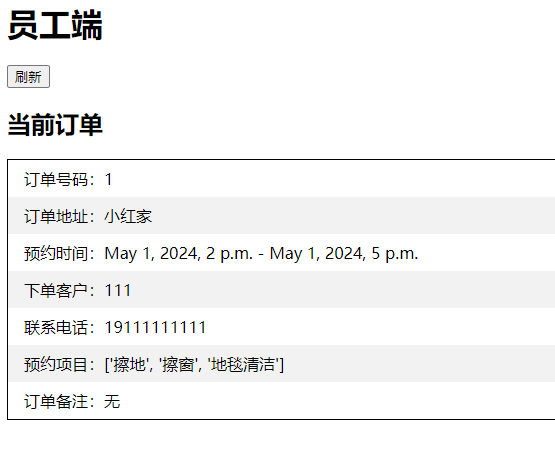
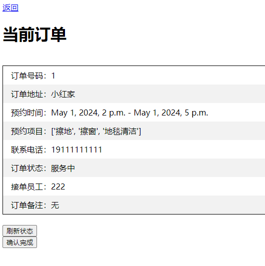
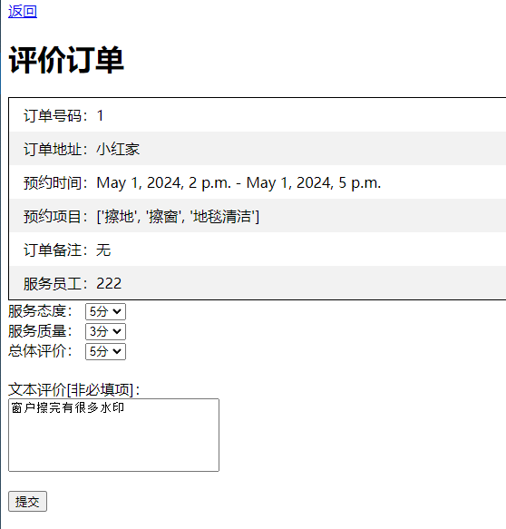
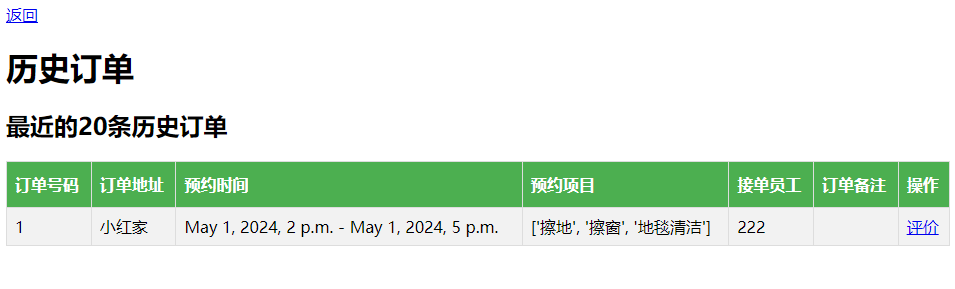
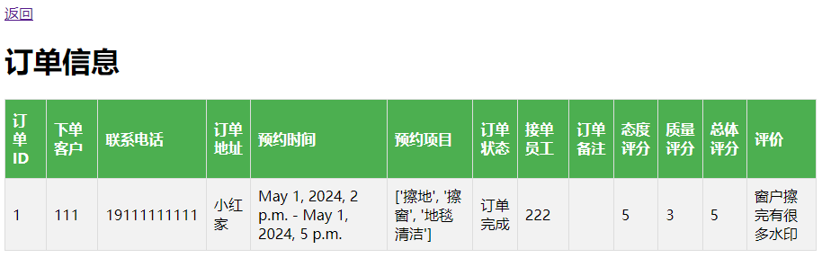
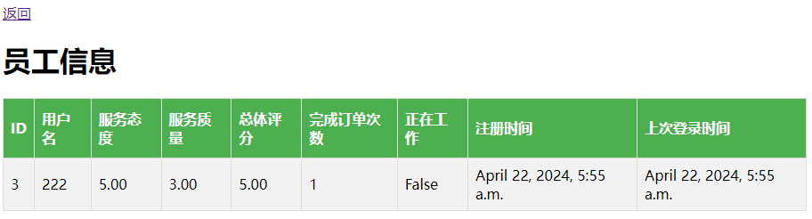

# 家政服务网站

一个使用**Django**框架开发的家政服务网站，实现了下单、接单、评价等功能。

*⚠ 仅作为 ~~作业~~ 练习项目，不具备实际使用价值。*

## 结构

类似于外卖、网约车等服务的模式；用户发布需求，家政员接单。

* 客户
    * 新建订单
    * 查看当前订单
    * 查看历史订单
    * 评价服务
* 家政员
    * 接受订单
* 管理员
    * 查看客户、家政员、订单信息

## 入口

* 客户：`/customer/`（用户名：111，密码：111）
* 家政员：`/worker/`（用户名：222，密码：222）
* 后台：`/backend/`（用户名：cc，密码：cc）

要同时登录多个账号，可以使用不同的浏览器或隐身模式。

## 截图

首页

新建订单

当前订单——客户端（等待接单）

挑选订单

当前订单——员工端

当前订单——客户端（服务中）

评价订单

历史订单

订单信息——后台

员工信息——后台

